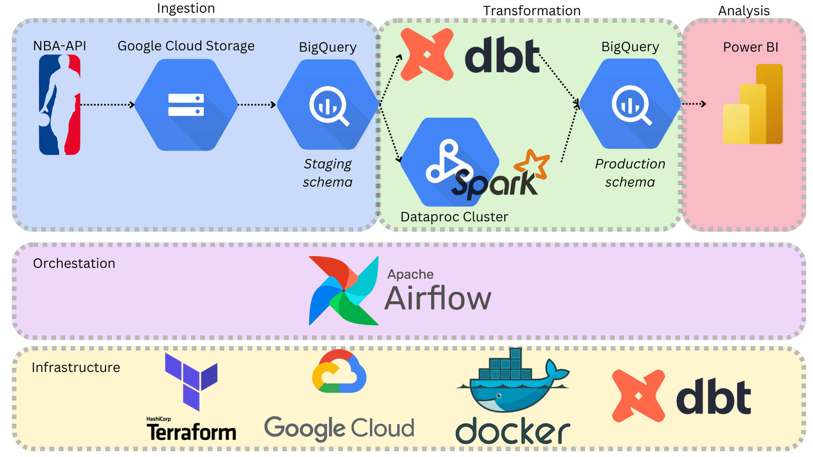

<!--
*** Thanks for checking out the Best-README-Template. If you have a suggestion
*** that would make this better, please fork the repo and create a pull request
*** or simply open an issue with the tag "enhancement".
*** Don't forget to give the project a star!
*** Thanks again! Now go create something AMAZING! :D
-->

<!-- PROJECT SHIELDS -->
<!--
*** I'm using markdown "reference style" links for readability.
*** Reference links are enclosed in brackets [ ] instead of parentheses ( ).
*** See the bottom of this document for the declaration of the reference variables
*** for contributors-url, forks-url, etc. This is an optional, concise syntax you may use.
*** https://www.markdownguide.org/basic-syntax/#reference-style-links
-->
[![Contributors][contributors-shield]][contributors-url]
[![Forks][forks-shield]][forks-url]
[![Stargazers][stars-shield]][stars-url]
[![Issues][issues-shield]][issues-url]
[![LinkedIn][linkedin-shield]][linkedin-url]

<!-- PROJECT LOGO -->
 

  

<h3 align="center">NBA Stats Data Pipeline</h3>

  

    This project was made using multiple data engineering tools (Airflow, dbt, Google Cloud Platform, etc.) and Power BI, to generate a working dataset and report based of NBA data such as: pts, ast, pf, etc. by player, team, season and game type.
     
    <a href="https://github.com/camiloms10/nba_stats_de"><strong>Explore the docs »</strong></a>
     
     
    <a href="https://github.com/camiloms10/nba_stats_de/issues">Report Bug</a>
    ·
    <a href="https://github.com/camiloms10/nba_stats_de/issues">Request Feature</a>
  

<!-- TABLE OF CONTENTS -->

  
Table of Contents

  <ol>
    <li>
      <a href="#about-the-project">About The Project</a>
      <ul>
        <li><a href="#built-with">Built With</a></li>
      </ul>
    </li>
    <li>
      <a href="#getting-started">Getting Started</a>
      <ul>
        <li><a href="#repository-organization">Repository Organization</a></li-->
        <li><a href="#data-sources">Data Sources</a></li>
      </ul>
    </li>
    <li><a href="#usage">Usage</a></li>
    <li><a href="#roadmap">Roadmap</a></li>
    <!--<li><a href="#contributing">Contributing</a></li>-->
    <!--<li><a href="#license">License</a></li>-->
    <li><a href="#contact">Contact</a></li>
    <!--<li><a href="#acknowledgments">Acknowledgments</a></li>-->
  </ol>

<!-- ABOUT THE PROJECT -->
## About The Project

This project focuses on creating a data pipeline using multiple data engineering tools (Airflow, dbt, Google Cloud Platform, etc.) to extract, transform and load data info Bigquery and finally use NBA data in Power BI as our dashboard visualization tool.

(<a href="#top">back to top</a>)

### Built With

- Cloud: GCP
- Infrastructure as code (IaC): Terraform
- Workflow orchestration: Airflow (ingestion pipeline and transformation pipeline)
- Data Warehouse: BigQuery
- Data Lake: GCS
- Batch processing/Transformations: dbt cloud or DataProc/Spark (transformation pipeline)
- Stream processing: None
- Dashboard: Power BI

(<a href="#top">back to top</a>)

<!-- GETTING STARTED -->
## Getting Started

### Repository organization
- \airflow: airflow files (docker-compose.yaml, Dockerfile, requirements, dags folder, etc.).  
- \assets: pictures.  
- \dbt: dbt files (dbt_project.yml, models, etc.).  
- \spark: python program for data transformation (option b).  
- \terraform: terraform files for the definition of the infrastructure to deploy.  
- \README.md: this document.
- \setup_dbt.md: dbt setup document.
- \setup_gcp.md: gcp setup document.

(<a href="#top">back to top</a>)

### Data Sources

Formula 1 race data from the years 1940 till now. This data set is based on the public [NBA API](https://github.com/swar/nba_api/tree/master) 

  * The NBA API contains lots of endpoints with following info:
    * players
    * teams
    * scoreboard
    * teamgamelogs
    * playergamelogs
    * LOTS MORE

(<a href="#top">back to top</a>)

<!-- USAGE EXAMPLES -->
## Usage

You can use this data to analyze:
* How a player or team has performed through time
* Compare players and/or teams based on NBA key metrics
* Easily obtain the top performers for a specific NBA key metric
* Ranking the player and teams based on their performance 
* Etc.

(<a href="#top">back to top</a>)

<!-- ROADMAP -->
## Roadmap

  

**Infrastructure as code:**  
  Use Terraform to create a bucket GCS and dataset in BQ  
  - import-bucket-camiloms10 bucket to store parquet files.
  - BQ_DATASET_DEV dataset for the ingestion into BigQuery.
  - BQ_DATASET_PRD dataset for dbt cloud production environment. 
  
**Orchestration:**  
  
  

  

  Use Airflow to orchestrate data ingestion and transformation (dbt) pipelines. Orchestration of dbt cloud job with airflow requires access to API (either trial or team or enterprise plans). If you do not have access to API, it is possible ro run dbt cloud job manually.

**Data ingestion:**  
  
  Use Airflow to get data from AWS bucket to GCS and then to BigQuery (regular, non external tables).  
  Although it is possible to use BigQuery external tables (linked to parquet files in GCS) to perform transformations, these may be slower than regular tables. Also, optimization of queries over external tables would require partitioning of parquet files.
  - Dag `bq_data_ingestion_players_dag` to ingest players data only once (Staging & Prod Schema). 
  - Dag `bq_data_ingestion_teams_dag` to ingest players data only once (Staging & Prod Schema).
  - Dag `bq_data_ingestion_players_stats_past_dag` to ingest players game stats from NBA seasons since the minimum date in the source till last seasons end.
  - Dag `bq_data_ingestion_players_stats_current_dag` to ingest players game stats from NBA seasons since the minimum date in the source from current season start, updated daily.

**Transformations (option A):**  

  

  
  Use dbt cloud to perform unions, joins and aggregations on BQ.  
  - Core (materialized=table):  
    - Players and Teams: Create prod model from teams and players tables in Big Query.
    - `nba_players_games_stats_all` materialized model by joining making an incremental model with the union between `players_game_stats_current_season` and `players_game_stats_past` (both in staging).
  - Job:
    - For the convenient creation of the production dataset, a job `dbt build` will be created.
    - This job can be run manually from dbt cloud or through airflow dags previously mentioned, which will run on a daily basis.

**Transformations (option B):**  

  In order to compare different solutions for the transformation stage, option A uses DataProc (managed solution of Spark&Hadoop) to perform the same transformations of those of option A, but reading directly from the Google Cloud bucket the parquet files.  
  `bq_data_transformation_players_stats_dataproc_spark_job` dag which will perform the following tasks:  

  - `create_dataproc_cluster_task`: At least, 2 nodes, 16GB, 4 vCores each one.
  - `upload_main_to_gcs_task`: DataProc will get the main program to execute for the job from Google Cloud Storage, so we will upload it in our bucket. The main program is a `python-pyspark` program located in the `spark` folder.
  - `submit_dataproc_spark_job_task`: A job is submitted to DataProc cluster in order to execute our main program.
  - `delete_dataproc_cluster_task`: Delete the cluster in order to avoid unnecessary costs. **Warning!** Dataproc uses temporal buckets to store internal data, once the cluster is deleted, it is possible that these buckets are not deleted, so check you google cloud storage.    

**Dashboard:**  

  

  
  Connect Power BI Desktop to BQ dataset and design dashboard  

## Final Conclusions

The NBA dashboard can be used to analyze in different ways the NBA players game stats from the free NBA-api, you can see the data summarized just to identify the top players, teams for each of the stats that are contained inside the API.

This development has been a real challenge since I could explore new ways to present and show the key metrics for the end user to take advantage of the data showed in it.

See the [open issues](https://github.com/camiloms10/f1dashboard/issues) for a full list of proposed features (and known issues).

(<a href="#top">back to top</a>)

<!-- CONTRIBUTING 
## Contributing

Contributions are what make the open source community such an amazing place to learn, inspire, and create. Any contributions you make are **greatly appreciated**.

If you have a suggestion that would make this better, please fork the repo and create a pull request. You can also simply open an issue with the tag "enhancement".
Don't forget to give the project a star! Thanks again!

1. Fork the Project
2. Create your Feature Branch (`git checkout -b feature/AmazingFeature`)
3. Commit your Changes (`git commit -m 'Add some AmazingFeature'`)
4. Push to the Branch (`git push origin feature/AmazingFeature`)
5. Open a Pull Request

(<a href="#top">back to top</a>)

-->

<!-- LICENSE 
## License

Distributed under the MIT License. See `LICENSE.txt` for more information.

(<a href="#top">back to top</a>)

-->

<!-- CONTACT -->
## Contact

Camilo Manzur - [@LinkedIn](https://www.linkedin.com/in/camilo-manzur-4b7137a8/)

Project Link: [https://github.com/camiloms10/f1dashboard/](https://github.com/camiloms10/f1dashboard)

Portfolio Link: [https://camiloms10.github.io/](https://camiloms10.github.io/)

(<a href="#top">back to top</a>)

<!-- ACKNOWLEDGMENTS 
## Acknowledgments

* 
* 
* 

(<a href="#top">back to top</a>)

-->

<!-- MARKDOWN LINKS & IMAGES -->
<!-- https://www.markdownguide.org/basic-syntax/#reference-style-links -->
[contributors-shield]: https://img.shields.io/github/contributors/camiloms10/soccer_players_value.svg?style=for-the-badge
[contributors-url]: https://github.com/camiloms10/nba_stats_de/graphs/contributors
[forks-shield]: https://img.shields.io/github/forks/camiloms10/soccer_players_value.svg?style=for-the-badge
[forks-url]: https://github.com/camiloms10/nba_stats_de/network/members
[stars-shield]: https://img.shields.io/github/stars/camiloms10/soccer_players_value.svg?style=for-the-badge
[stars-url]: https://github.com/camiloms10/nba_stats_de/stargazers
[issues-shield]: https://img.shields.io/github/issues/camiloms10/soccer_players_value.svg?style=for-the-badge
[issues-url]: https://github.com/camiloms10/nba_stats_de/issues
[linkedin-shield]: https://img.shields.io/badge/-LinkedIn-black.svg?style=for-the-badge&logo=linkedin&colorB=555
[linkedin-url]: https://www.linkedin.com/in/camilo-manzur-4b7137a8/
[product-screenshot]: images/screenshot.png